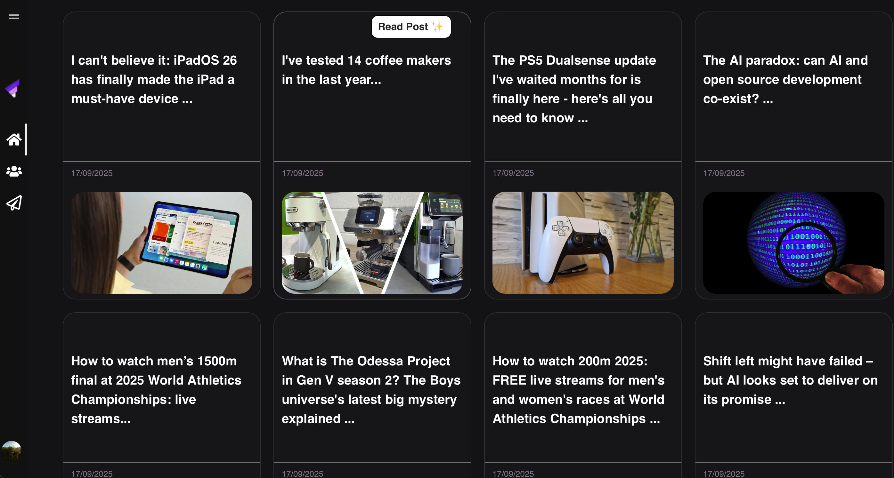
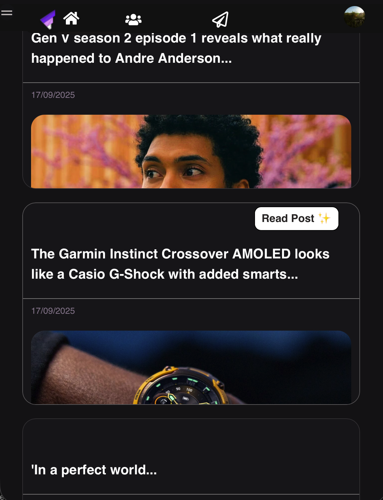

# 🌐 AI-Powered News + Community Platform

A **full-stack platform** where users and **community members** interact around the latest news.  
Users can comment, save, dislike, or bookmark news posts, while members contribute **sentiment-aware, contextually relevant responses**.  

Built with **Node.js, Express, MongoDB, Python, and React**, this project demonstrates **modern full-stack development**, authentication, AI integration, and interactive UI features.  

<video width="1431" height="771" src="https://github.com/user-attachments/assets/b4fad252-345f-49cf-925d-e35e907f5897"/>
 

---

## ✨ Key Features

- 🔑 **User Authentication** – Secure login with daily action limits.  
- 📰 **Dynamic News Feed** – AI-powered RSS aggregation for any topic, delivering **up-to-date news**.  
- 👥 **Communities** – Users can join or create communities to discuss news and share opinions.  
- 📝 **Posts & Comments** – Users can comment, reply, and engage in nested discussions.  
- 💾 **Save, Dislike, Bookmark** – Curate personal feeds by saving favorites, bookmarking, or expressing opinions.  
- 📊 **Action Tracking** – All user interactions logged for transparency and activity limits.  
- 🎨 **Responsive Frontend** – Built with React (or Vanilla JS alternative) for a smooth, modern UI.  

---

## 🛠️ Tech Stack

- **Frontend:** React / Vanilla JS + CSS (responsive, interactive UI)  
- **Backend:** Node.js + Express  
- **Database:** MongoDB with Mongoose ODM  
- **AI Layer:** External AI service for news aggregation, recommendation, and summarization  
- **RSS Aggregation:** Fetch latest, media-rich news feeds  

---

## 🚀 What I Focused On

- Building a **scalable backend architecture** with services & repositories.  
- Designing **clean, reusable APIs** for users, communities, posts, comments, and news.  
- Implementing **authentication & access control** for real users.  
- Creating a **responsive, recruiter-friendly UI** that showcases full-stack integration.  
- Integrating an **AI-powered news service** to deliver relevant, high-quality news.  
- Curating **media-rich news feeds** for interactive discussion.  


## 📌 Why This Project?

This project demonstrates **real-world full-stack development** for professional roles:  

- Backend architecture: REST APIs, database models, repositories, and AI integration.  
- Frontend development: interactive React components, forms, dynamic news feed.  
- AI-assisted news aggregation for up-to-date content delivery.  
- Practical **full-stack engineering skills** that stand out to recruiters.  

---

## 🧑‍💻 Setup (Quick Start)

```bash
# Clone the repo
git clone https://github.com/yourusername/social-ai-community.git
cd social-ai-community

# Install backend dependencies
npm install

# Run backend
npm start

# (Optional) Start frontend
cd client
npm start
